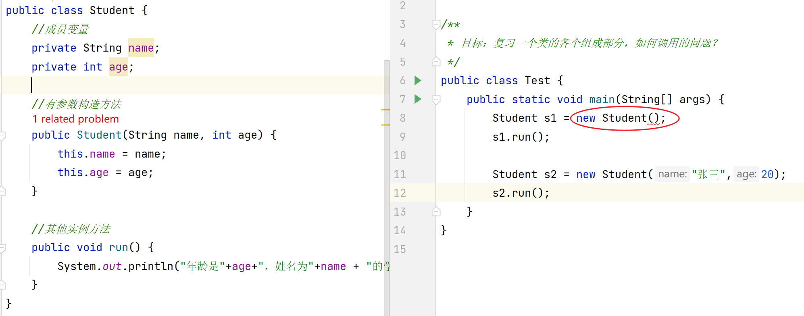
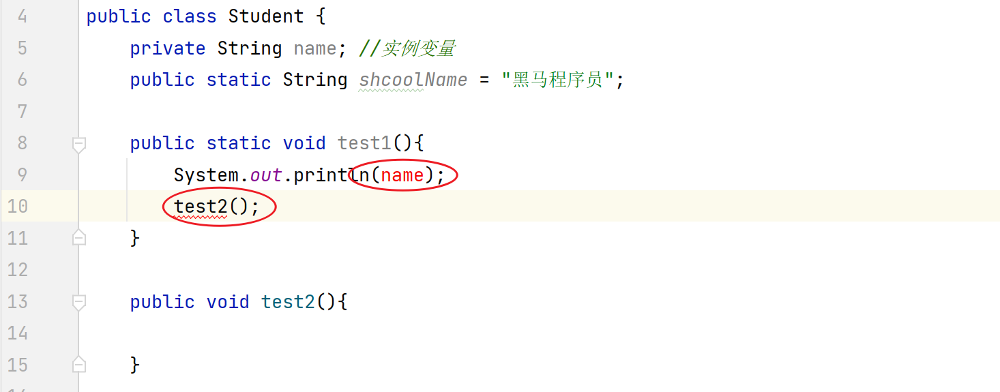

# 一、简答题

## 简答题一

如何使用idea跟踪代码的执行流程，自己试试

```java
答： 按住ctrl键不松，鼠标移动到想看的代码上，变成一个小手，点击就可以查看对应执行的代码。
```


## 简答题二

观察如图所示代码，说出红色圆圈位置，为什么会报错。



```java
答： 当你写了有参数构造方法，空参数构造方法就没有了。 测试类中使用空参数构造方法创建对象，永不了。
```


## 简答题三

观察如图所示代码，说明红色圆圈位置，为什么会报错。



```java
答：
	第8行：静态方法中，不能访问实例变量
	第10行：静态方法中，不能访问实例方法
```


## 简答题四

观察如图所示代码，完成注释位置的需求，填写对应的代码


```java
第11行： Systemlout.println(this.num);
第12行： Systemlout.println(super.num);
第13行： this.show();
第14行： super.show();
```


## 简答题五

方法重写有何意义，说出你的理解。

```java
答：
	当父类的方法不完全满足子类的需求，子类可以重写父类方法。这样既保证父类方法不变，子类有也自己的实现。
	
```


## 简答题六

说出继承后，构造方法的访问特点。如图所示，解释红色圈圈代码的含义


```java
答：
	1)默认下，子类的构造方法中都会调用父类的空参数构造方法
		   原因：第一句是super();
	2)如果不想使用默认的访问方式，可以手动通过 super(参数) 访问父类有参数构造方法
```


# 二、编程题

## 编程题一

- 1. 定义项目经理类 

  ```java
  属性：
  	姓名 工号 工资 奖金
  行为：
  	工作work
  ```

- 2. 定义程序员类

  ```java
  属性：
  	姓名 工号 工资
  行为：
  	工作work
  ```

- 3. 向上抽取一个父类，共有成员放父类，特有成员放子类

- 4. 编写测试类:完成这两个类的测试

```java
//抽取的父类
public class Employee {
    //姓名 工号 工资 奖金
    private String id;
    private String name;
    private int salary;

    public Employee() {
    }

    public Employee(String id, String name, int salary) {
        this.id = id;
        this.name = name;
        this.salary = salary;
    }

    public String getId() {
        return id;
    }

    public void setId(String id) {
        this.id = id;
    }

    public String getName() {
        return name;
    }

    public void setName(String name) {
        this.name = name;
    }

    public int getSalary() {
        return salary;
    }

    public void setSalary(int salary) {
        this.salary = salary;
    }
}

//程序员类
public class Programer extends Employee{

    public Programer() {
    }

    public Programer(String id, String name, int salary) {
        super(id, name, salary);
    }
}

//项目经理类
public class ProjectManager extends Employee {
    //姓名 工号 工资 奖金
    private String id;

    public ProjectManager(String id) {
        this.id = id;
    }

    public ProjectManager(String id, String name, int salary, String id1) {
        super(id, name, salary);
        this.id = id1;
    }
}

//测试类
public class Test1 {
    public static void main(String[] args) {
        Programer p = new Programer();
        p.setId("001");
        p.setName("小黑");
        p.setSalary(20000);

        System.out.println(p.getId()+"..."+p.getName()+"..."+p.getSalary());

        ProjectManager pm = new ProjectManager("002","大黑",25000,5000);
        System.out.println(pm.getId()+"..."+pm.getName()+"..."+pm.getSalary()+"..."+pm.getName());
    }
}
```


## 编程题二

- 1. 定义动物类，要求如下

  ```java
  - 属性：
  	年龄，颜色
  - 行为:
  	eat(String something)方法(无具体行为,something表示吃的东西)
  - 生成空参有参构造，set和get方法
  ```

- 2. 定义狗类继承动物类，要求如下

  ```java
  行为:
  	eat(String something)方法(有具体行为)
  	lookHome方法(无参数)方法
  ```

- 3. 定义猫类继承动物类

  ```java
  行为:
  	eat(String something)方法(有具体行为)
  	catchMouse方法(无参数)方法
  ```

- 4. 定义Person类

  ```java
  属性：
  	姓名，年龄
  
  行为：
  	keepPet(Dog dog,String something)方法
  	功能：喂养宠物狗，something表示喂养的东西
  	该方法调用后打印结果为：颜色为黑色的2岁的狗，在吃骨头
  
  	keepPet(Cat cat,String something)方法
  	功能：喂养宠物猫，something表示喂养的东西
  	该方法调用后打印结果为：颜色为白色的2岁的猫，在吃小鱼干
  ```

- 5. 定义测试类，测试以上方法

```java
//动物类
class Animal {
    private int age;
    private String color;

    public Animal() {
    }

    public Animal(int age, String color) {
        this.age = age;
        this.color = color;
    }

    public int getAge() {
        return age;
    }

    public void setAge(int age) {
        this.age = age;
    }

    public String getColor() {
        return color;
    }

    public void setColor(String color) {
        this.color = color;
    }

    public void eat(String something){

    }
}

//狗类
public class Dog extends Animal{

    public Dog() {
    }

    public Dog(int age, String color) {
        super(age, color);
    }

    @Override
    public void eat(String something){
        System.out.println("颜色为"+getColor()+"的"+getAge()+"岁的狗，在吃骨头");
    }

    public void lookHome(){
        System.out.println("小狗在看家");
    }
}

//猫类
public class Cat extends Animal{
    public Cat() {
    }

    public Cat(int age, String color) {
        super(age, color);
    }

    @Override
    public void eat(String something){
        System.out.println("颜色为"+getColor()+"的"+getAge()+"岁的猫，在吃小鱼干");
    }

    public void catchMouse方法(){
        System.out.println("小猫在抓老鼠");
    }
}

//测试类
public class Test2 {
    public static void main(String[] args) {
        Person p = new Person();

        Dog dog = new Dog(2,"黑色");
        p.keepPet(dog,"骨头");

        Cat cat = new Cat(2,"白色");
        p.keepPet(cat,"小鱼干");
    }
}
```


## 编程题三

完成代码(按照标准格式写)，然后在测试类中测试。

- 1. 手机类Phone

  ```java
  属性:
  	品牌brand,价格price
  行为:
  	打电话call,
  	发短信sendMessage,
  	玩游戏playGame
  ```

- 2. 测试类，创建Phone类对象,调用Phone类中的方法

- 3. 思考: 假设所有的手机都有屏幕的尺寸(int size)，而且假设所有手机的屏幕尺寸为6,应该如何实现?  

```java
public class Phone {
    private String brand;
    private int price;
    private int size;

    public Phone() {
    }

    public Phone(String brand, int price) {
        this(brand,price,6);
    }

    public Phone(String brand, int price, int size) {
        this.brand = brand;
        this.price = price;
        this.size = size;
    }

    //	打电话call,
    public void call(){
        System.out.println("打电话");
    }
    //	发短信sendMessage,
    public void sendMessage(){
        System.out.println("发短信");
    }
    //	玩游戏playGame
    public void playGame(){
        System.out.println("打游戏");
    }

    public String getBrand() {
        return brand;
    }

    public void setBrand(String brand) {
        this.brand = brand;
    }

    public int getPrice() {
        return price;
    }

    public void setPrice(int price) {
        this.price = price;
    }

    public int getSize() {
        return size;
    }

    public void setSize(int size) {
        this.size = size;
    }
}

//测试类
public class Test3 {
    public static void main(String[] args) {
        Phone p = new Phone("黑米",1999);
        System.out.println("品牌："+p.getBrand());
        System.out.println("价格："+p.getPrice());
        System.out.println("尺寸："+p.getSize());
    }
}
```


## 编程题四

完成课堂上斗地主准备54张牌的案例，要求使用静态代码块

```java
public class Demo7 {
    //2)准备好一个集合，用于存储每一张牌
    private static ArrayList<String> list = new ArrayList<>();

    //1)为了让程序一运行就准备好54张牌，可以选择使用static代码块
    static {
        String[] colors = {"♥","♠","♣","♦"};
        String[] nums = {"A","2","3","4","5","6","7","8","9","10","J","Q","K"};
        //每一个点数配4个花色
        for (int i = 0; i < nums.length; i++) {
            for (int j = 0; j < colors.length; j++) {
                String poker = nums[i] + colors[j];
                list.add(poker);
            }
        }

        //单独添加大小王
        list.add("小王");
        list.add("大王");
    }

    public static void main(String[] args) {
        //3)遍历集合
        for (int i = 0; i < list.size(); i++) {
            String s = list.get(i);
            System.out.print(s+" ");
        }
    }
}
```

