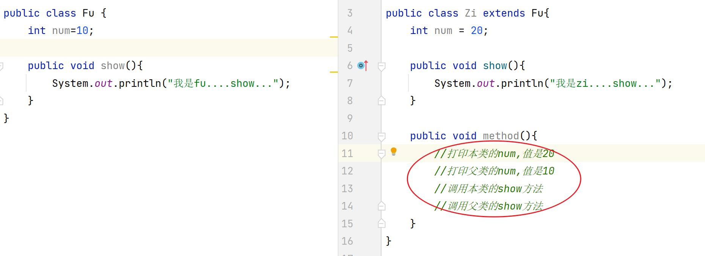

# 一、简答题

## 简答题一

使用idea跟踪代码的执行流程，自己试试

```java
答：按住ctrl键不松，把鼠标移动到你想看的到代码上，会变成一个小手，点击看代码调整到哪里。

ps: 以后要经常用这种小技巧，很多时候不理解代码，是因为对执行流程不熟悉，多点点就熟悉了。
```


## 简答题二

观察如图所示代码，说出红色圆圈位置，为什么会报错。


```java
答：没有空参构造方法
```


## 简答题三

观察如图所示代码，说明红色圆圈位置，为什么会报错。


```java
答：静态方法内无法访问实例属性和实例方法!
静态方法和静态属性是在类加载时就加载了,实例方法是对象创建的时候才创建
```


## 简答题四

观察如图所示代码，完成注释位置的需求，填写对应的代码



```java
第11行：System.out.println(this.num)
第12行：System.out.println(super.num)
第13行：this.show()
第14行：super.show()
```


## 简答题五

方法重写有何意义，说出你的理解。

```java
答：当父类的方法不能完全满足子类的需求，子类可以重写父类方法。既保证父类方法不变，子类有也自己的实现。
```


## 简答题六

说出继承后，构造方法的访问特点。如图所示，解释红色圈圈代码的含义


```java
答：第一个 -> 调用父类的无参构造方法
第二个 -> 调用父类的有参构造方法(num 参数)
```


# 二、编程题

## 编程题一

- 1. 定义项目经理类 

  ```java
  属性：
  	姓名 工号 工资 奖金
  行为：
  	工作work
  ```

- 2. 定义程序员类

  ```java
  属性：
  	姓名 工号 工资
  行为：
  	工作work
  ```

- 3. 向上抽取一个父类，共有成员放父类，特有成员放子类

- 4. 编写测试类:完成这两个类的测试

```java
将每个类代码粘贴到此处
```

## 编程题二

- 1. 定义动物类，要求如下

  ```java
  - 属性：
  	年龄，颜色
  - 行为:
  	eat(String something)方法(无具体行为,something表示吃的东西)
  - 生成空参有参构造，set和get方法
  ```

- 2. 定义狗类继承动物类，要求如下

  ```java
  行为:
  	eat(String something)方法(有具体行为)
  	lookHome方法(无参数)方法
  ```

- 3. 定义猫类继承动物类

  ```java
  行为:
  	eat(String something)方法(有具体行为)
  	catchMouse方法(无参数)方法
  ```

- 4. 定义Person类

  ```java
  属性：
  	姓名，年龄
  
  行为：
  	keepPet(Dog dog,String something)方法
  	功能：喂养宠物狗，something表示喂养的东西
  	该方法调用后打印结果为：颜色为黑色的2岁的狗，在吃骨头
  
  	keepPet(Cat cat,String something)方法
  	功能：喂养宠物猫，something表示喂养的东西
  	该方法调用后打印结果为：颜色为白色的2岁的猫，在吃小鱼干
  ```

- 5. 定义测试类，测试以上方法

```java
将每个类代码粘贴到此处
```


## 编程题三

完成代码(按照标准格式写)，然后在测试类中测试。

- 1. 手机类Phone

  ```java
  属性:
  	品牌brand,价格price
  行为:
  	打电话call,
  	发短信sendMessage,
  	玩游戏playGame
  ```

- 2. 测试类，创建Phone类对象,调用Phone类中的方法

- 3. 思考: 假设所有的手机都有屏幕的尺寸(int size)，而且假设所有手机的屏幕尺寸为6,应该如何实现?  


## 编程题四

完成课堂上斗地主准备54张牌的案例，要求使用静态代码块

```java

```

