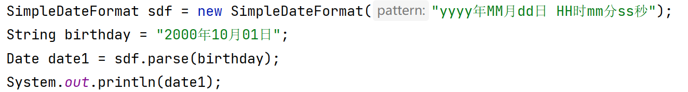
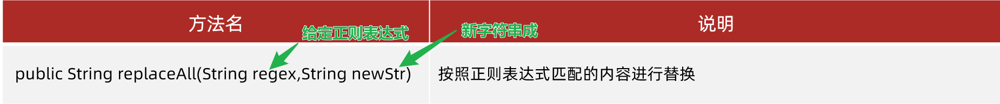

# 简答题

## 1. 简答题一

需求说明 

1. 请说出基本数据类型对应的八个包装类分别是什么? 
2. 请说出如何把字符串转换为对应的基本数据类型,有什么注意点? 

```java
答：
	byte			Byte
	short			Short
	int				Integer
	long			Long
	float			Float
	double			Double
	char		   Character
	boolean			Boolean

	学习包装类主要学习字符串和基本类型之间的转换
		1)基本类型 --> 字符串
			//String  变量 = 包装类.toString(基本类型的数据);
			String    str1 = Integer.toString(10);
			String    str2 = Double.toString(3.88);
			...
		
		)把字符串  --> 基本类型
			//基本类型  变量 = 包装类.parseXxx("字符串数据");
			int  		num1 = Integer.parseInt("12345");
			double  	num2 = Double.parseDouble("3.14");
			...
```


## 2. 简答题二

需求说明 

1. 请说出你对自动装箱的理解 ，举例说明
2. 请说出你对自动拆箱的理解，举例说明

```
答：
自动转型与自动拆箱
		Integer i1 = 10; //整数10会自动转型为Integer
		int i2 = i1 + 20; //i1是一个Integer对象,自动拆箱为int类型，再运算
```


## 3. 简答题三

观察下面的代码，下面代码运行是存在问题？如果有问题，请说明问题原因



```java
答： 要解析的字符串日期，和格式不对应
```


# 代码题

## 1. 训练案例

- 需求 :  键盘录入字符串 "10 20 50 30 40" ，录入字符串用nextLine()方法。中间用空格隔开
  - 查找String类的API找到split方法，使用该方法按照空格对字符串进行切割，得到一个字符串数组
  - 遍历数组，把字符串数组中的每一个元素转换为int类型
  - 再使用Arrays对int类型数组元素进行升序排列。

```java
public class Test1 {
    public static void main(String[] args) {
        Scanner sc = new Scanner(System.in);
        System.out.println("请输入一个字符串：");
        String str = sc.nextLine();  //"10 20 50 30 40"

        //查找String类的API找到split方法
        String[] array = str.split(" ");

        int[] newArray = new int[array.length];
        for (int i = 0; i < array.length; i++) {
            String s = array[i];
            //把字符串转换为int
            int num = Integer.parseInt(s);
            newArray[i] = num;
        }

        //再使用Arrays对int类型数组元素进行升序排列。
        Arrays.sort(newArray); 
        System.out.println(Arrays.toString(newArray));
    }
}
```


## 2. 训练案例

需求：按照下面要求，使用Arrays的sort方法和Lamdba表达式完成自定义对象的排序

- 定义一个Student类，有姓名和年龄两个属性，并提供get和set以及toString方法
- 创建4个Student对象，并添加到数组中
- 使用Arrays的sort方法对学生对象按照年龄的升序排列，排列规则用Lamdba表达式来写。 
- 遍历打印数组中的每一个学生对象的姓名和年龄
- 【注意：排序规则是两个对象的年龄相减，不是两个对象相减】

```java
public class Test2 {
    public static void main(String[] args) {
        Student s1 = new Student("张三",20);
        Student s2 = new Student("李四",18);
        Student s3 = new Student("王五",15);
        Student s4 = new Student("赵六",22);

        //并添加到数组中
        Student[] array = new Student[4];
        array[0] = s1;
        array[1] = s2;
        array[2] = s3;
        array[3] = s4;

        //使用Arrays的sort方法对学生对象按照年龄的升序排列，排列规则用Lamdba表达式来写。
        Arrays.sort(array,(o1, o2) -> o2.getAge()-o1.getAge());

        System.out.println(Arrays.toString(array));
    }
}
```


## 3. 训练案例

需求1 :   使用Date类和SimpleDateFormat完成下面需求

- 键盘录入你的生日字符串 （如：”1998年08月08日“）
- 将生日字符串使用SimpleDateFormat解析为Date对象
- 计算当前日期距离生日那天有多少天？

```java
public class Test3 {
    public static void main(String[] args) throws ParseException {
        Scanner sc = new Scanner(System.in);
        System.out.println("键盘录入一个生日：");
        String birthday = sc.next();

        SimpleDateFormat sdf = new SimpleDateFormat("yyyy年MM月dd日");
        Date date = sdf.parse(birthday);
        //生日那天的毫秒值
        long time1 = date.getTime();

        //距离当前有多少天
        long time2 = new Date().getTime();

        long day = (time2-time1)/1000/60/60/24;
        System.out.println("你活了："+day+"天");  
    }
}
```


## 4. 训练案例

已知字符串 :  

```java
String content = "先帝1创业2未半而中道3崩殂4，今5天下三分6，益州疲弊7，此8诚危急存亡之秋也。然9侍卫之臣不懈于内，忠志之士忘身10于外者，盖追先帝之殊遇11，欲报之于陛下也。诚宜12开张圣听13，以光14先帝遗德，恢弘15志士之气，不宜妄自菲薄16，引喻失义17，以塞忠谏之路也18。\n" +
                "宫中府中，俱为一体19；陟罚臧否20，不宜异同：若有作奸犯科21及为忠善者22，宜付有司23论其刑赏24，以昭陛下平明之理25；不宜偏私26，使内外异法也27。\n" +
                "侍中、侍郎郭攸之、费祎、董允等，此皆良实，志虑忠纯28，是以先帝简拔以遗陛下29：愚以为宫中之事，事无大小，悉以咨之30，然后施行，必能裨补阙漏31，有所广益32。";
```

需求 :  请将上面字符串中的数字替换为*号,  在控制台打印去除后的结果

提示：使用String类中的repalceAll方法，可以讲匹配正则表达式的内容，替换为新的内容



```java
public class Test4 {
    public static void main(String[] args) {
        String content = "先帝1创业2未半而中道3崩殂4，今5天下三分6，益州疲弊7，此8诚危急存亡之秋也。然9侍卫之臣不懈于内，忠志之士忘身10于外者，盖追先帝之殊遇11，欲报之于陛下也。诚宜12开张圣听13，以光14先帝遗德，恢弘15志士之气，不宜妄自菲薄16，引喻失义17，以塞忠谏之路也18。\n" +
                "宫中府中，俱为一体19；陟罚臧否20，不宜异同：若有作奸犯科21及为忠善者22，宜付有司23论其刑赏24，以昭陛下平明之理25；不宜偏私26，使内外异法也27。\n" +
                "侍中、侍郎郭攸之、费祎、董允等，此皆良实，志虑忠纯28，是以先帝简拔以遗陛下29：愚以为宫中之事，事无大小，悉以咨之30，然后施行，必能裨补阙漏31，有所广益32。";

        String s = content.replaceAll("\\d", "*");
        System.out.println(s);
    }
}
```


## 5. 训练案例

* 需求 : 使用数组工具类Arrays完成下面的三个需求 
  * 对数组进行排序
  * 查找数组中的元素

```java
Integer[] array = {90, 70, 50, 60, 30, 10, 20, 40, 80};

//1.打印数组中的元素
String str = Arrays.toString(array);
System.out.println(str);  //[90, 70, 50, 60, 30, 10, 20, 40, 80];

//对元素进行排序
//2.1对数组的元素排序(默认升序排列)
Arrays.sort(array);

//2.2对数组的元素排序(手动排序规则)
//参数1： 需要排序的数组
//参数2：Comparator匿名内部类对象，用来指定排序规则
Arrays.sort(array, new Comparator<Integer>() {
    @Override
    public int compare(Integer o1, Integer o2) {
        return o2-o1;
    }
});

//3.查找数组中指定的元素索引
//二分查找之前，必须对数组进行排序（升序）
Arrays.sort(array);
System.out.println(Arrays.toString(array));

int index = Arrays.binarySearch(array, 30);
System.out.println(index);
```


