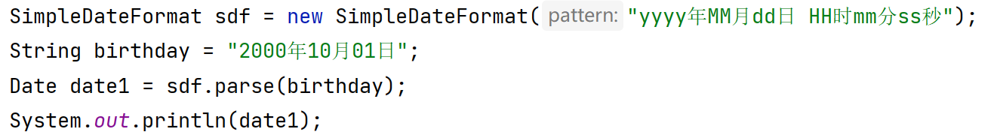

# 简答题

## 1. 简答题一

需求说明 

1. 请说出基本数据类型对应的八个包装类分别是什么? 
2. 请说出如何把字符串转换为对应的基本数据类型,有什么注意点? 

```java
答：
```


## 2. 简答题二

需求说明 

1. 请说出你对自动装箱的理解 ，举例说明
2. 请说出你对自动拆箱的理解，举例说明

```
答：
```


## 3. 简答题三

观察下面的代码，下面代码运行是存在问题？如果有问题，请说明问题原因



```java
答： 
```


# 代码题

## 1. 训练案例

- 需求 :  键盘录入字符串 "10 20 50 30 40" ，录入字符串用nextLine()方法。中间用空格隔开
  - 查找String类的API找到split方法，使用该方法按照空格对字符串进行切割，得到一个字符串数组
  - 遍历数组，把字符串数组中的每一个元素转换为int类型
  - 再使用Arrays对int类型数组元素进行升序排列。

```java

```


## 2. 训练案例

需求：按照下面要求，使用Arrays的sort方法和Lamdba表达式完成自定义对象的排序

- 定义一个Student类，有姓名和年龄两个属性，并提供get和set以及toString方法
- 创建4个Student对象，并添加到数组中
- 使用Arrays的sort方法对学生对象按照年龄的升序排列，排列规则用Lamdba表达式来写。 
- 遍历打印数组中的每一个学生对象的姓名和年龄
- 【注意：排序规则是两个对象的年龄相减，不是两个对象相减】

```java

```


## 3. 训练案例

需求1 :   使用Date类和SimpleDateFormat完成下面需求

- 键盘录入你的生日字符串 （如：”1998年08月08日“）
- 将生日字符串使用SimpleDateFormat解析为Date对象
- 计算当前日期距离生日那天有多少天？

```java

```


## 4. 训练案例

使用String类中的repalceAll方法，将字符串中的数字替换为`*`号


```java
public class Test4 {
    public static void main(String[] args) {
        String content = "先帝1创业2未半而中道3崩殂4，今5天下三分6，益州疲弊7，此8诚危急存亡之秋也。然9侍卫之臣不懈于内，忠志之士忘身10于外者，盖追先帝之殊遇11，欲报之于陛下也。诚宜12开张圣听13，以光14先帝遗德，恢弘15志士之气，不宜妄自菲薄16，引喻失义17，以塞忠谏之路也18。\n" +
                "宫中府中，俱为一体19；陟罚臧否20，不宜异同：若有作奸犯科21及为忠善者22，宜付有司23论其刑赏24，以昭陛下平明之理25；不宜偏私26，使内外异法也27。\n" +
                "侍中、侍郎郭攸之、费祎、董允等，此皆良实，志虑忠纯28，是以先帝简拔以遗陛下29：愚以为宫中之事，事无大小，悉以咨之30，然后施行，必能裨补阙漏31，有所广益32。";

      
    }
}
```


## 5. 训练案例

* 需求 : 使用数组工具类Arrays完成下面的三个需求 
  * 对数组进行排序
  * 查找数组中的元素

```java
Integer[] array = {90, 70, 50, 60, 30, 10, 20, 40, 80};

//1.打印数组中的元素

//对元素进行排序
//2.1对数组的元素排序(默认升序排列)


//2.2对数组的元素排序(手动排序规则)


//3.查找数组中指定的元素索引
//二分查找之前，必须对数组进行排序（升序）

```


