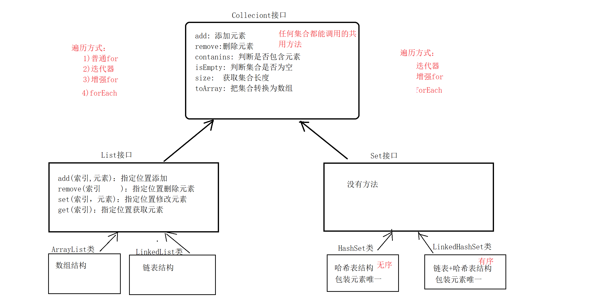

### Collection

- 集合体系

```
--- Collection
        --List (有序,有索引,可重复)
            --ArrayList
            --LinkedList
        --Set(无序,无索引,不可重复)
            --HashSet
                --LinkedHashSet
            --TreeSet
```

- 通用方法

```java
public interface Collection {
    //返回集合长度
    int size();

    //判断是否为空
    boolean isEmpty();

    //判断时候包含某一元素
    boolean contains(Object o);

    //转化为数组
    Object[] toArray();

    //增加
    boolean add(E e);

    //移除指定元素
    boolean remove(Object o);

    //清空元素
    void clear();

    //移除符合条件的元素
    default boolean removeIf(Predicate<? super E> filter) {
    }

    ;
}
```

### 通用遍历方式

```properties
1:迭代器
2:增强for循环
3:forEach (需要lambda支持 jdk8 以后才支持)
```

````java
class Test {
    public static void main(String[] args) {
        ArrayList<String> strings = new ArrayList<>();
        //增加元素
        strings.add("张三丰");
        strings.add("张无忌");
        strings.add("谢逊");
        strings.add("白毛鹰王");
        strings.add("小昭");
        strings.add("俊阳公主");

        //第一种遍历方式
        Iterator<String> iterator = strings.iterator();
        while (iterator.hasNext()) {
            System.out.println(iterator.next());
        }

        System.out.println("-----------------------------------------------------");

        //第二种便利方式
        for (String string : strings) {
            System.out.println(string);
        }

        System.out.println("-----------------------------------------------------");

        //第三种遍历方式
        strings.forEach(System.out::println);
    }
}
````

### 数据结构

```properties
栈结构:先进后出
队列结构:先进先出

数组:有索引 查询快,插入慢
链表:没有索引, 插入快, 查询慢

二叉树:每一个节点最多只有两个子节点

二叉搜索树:\
  1)每一个节点最多只有两个子节点\
  2)任意一个节点左边的节点都比自己小，右边的节点都比自己大

二叉平衡树:\
  1)每一个节点最多只有两个子节点\
  2)任意一个节点左边的节点都比自己小，右边的节点都比自己大\
  3)任何一个节点它的左子树和右子树的高度差不超过1

红黑树: \
  1)通过红黑树自己的规则实现的\
  2)任何一个节点必须是红色或者黑色, 根节点必须是黑色\
  3)如果一个节点没有字节点, 那么他必须指向Nil节点(叶子结点), Nil节点必须是黑色的\
  4)如果一个节点是红色的,那么他的子节点必须是黑色的,不能连续两个红色节点\
  5)任何一个节点到其叶子节点的简单路径,均包含相同的黑色节点
```

### List

 - list特有方法(针对索引的操作)
```java
interface Test{
    /**
     * @param index : list集合中的索引
     * @param e : 对象
     * @work : 设置集合index索引位置的值为e 
     */
    void set(int index, E e);

    /**
     * @param index : list集合中的索引
     * @return : 索引位置对应的元素
     */
    E get(int index);

    /**
     * 
     * @param index :  list集合中的索引
     * @param e : 要添加的元素
     * @work :  讲数据添加的指定索引位置
     */
    void add(int index, E e);

    /**
     * @param index : list集合中的索引
     * @return : 删除元素的值
     * @work : 删除指定索引位置的元素,返回该元素的值
     */
    E remove(int  index);
    
}
```

- 不同List集合的特点
````properties
ArrayList: 数组结构(查询快、增删慢)
LinkedList : 双向链表结构(查询慢、增删快)
````

### Set

```properties
方法 : Set 没有索引, 没有任何特有方法
特点 : 无序,无索引 ,不可重复
```

#### HashSet
```properties
底层存储结构 : 数组+链表+红黑树
特点 : 无序, 无索引 , 不可重复
```
#### LinkedHashSet
```properties
底层存储结构 : 链表+ 哈希表
特点 : 有序, 无索引 , 不可重复
```

#### TreeSet
```properties
底层存储结构 : 红黑树+
特点 : 可排序 , 无索引 , 不可重复
```


